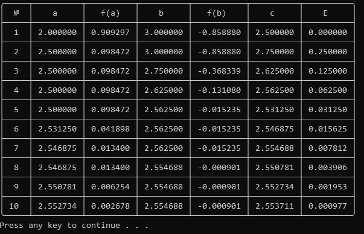
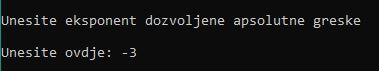

# Console application

#### This application is a helping tool for solving equations. The program is written for college.

\
For building this console application, there are some requirements:

- [python3](https://www.python.org/downloads/)
- [pip](https://www.geeksforgeeks.org/how-to-install-pip-on-windows/)
- [tabulate](https://pypi.org/project/tabulate/)

\
_starting the program with command prompt from src folder:_

    python main.py

\
_this example of an input (inserted sequentially):_

    2
    1
    -3
    2
    3
    6

produces the following output:\
\

 

### How to write the exponent:

\

\
by writing the exponent, do have in mind that it will be in the following format:

| console input | interpretation |
| ------------- | -------------- |
| -3            | 10^(-3)        |
| 4             | 10^4           |
| -6            | 10^(-6)        |

 

### Note:

There are no exception handlers, so keep that in mind while using this application. If the application just closes without any alert, that probably means there was a problem with the inputs. In case that happens, running the application from the command prompt will make it possible to see the error that occurs.
