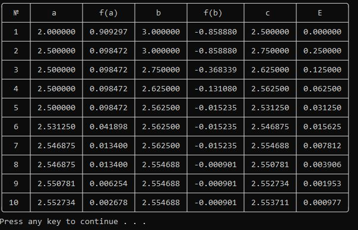

# Console application

#### This application is a helping tool for solving equations.

_starting the program from cmd:_

    mathematics> python main.py

_the example of an input:_

    2
    1
    -3
    2
    3
    6

the following output:

